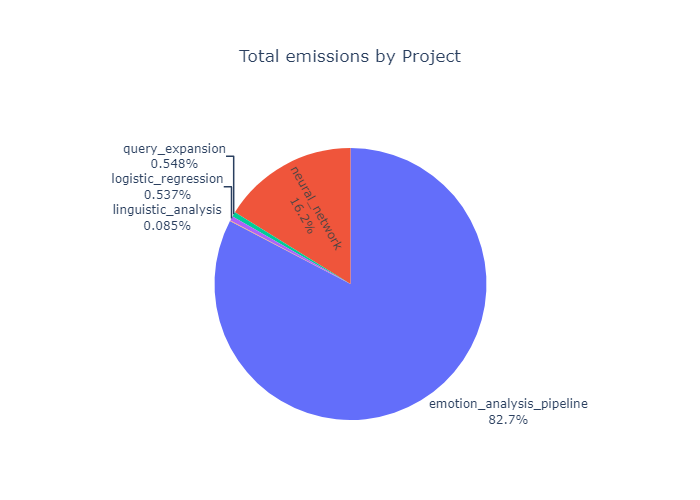
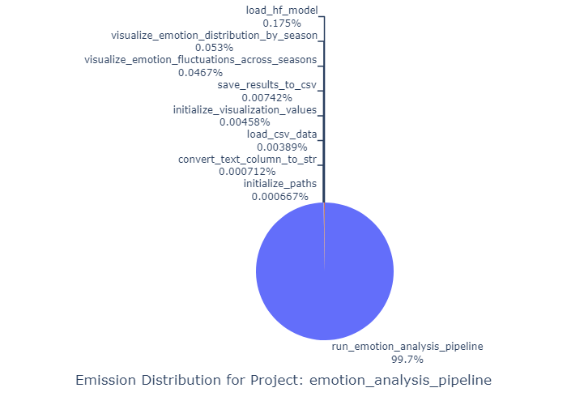
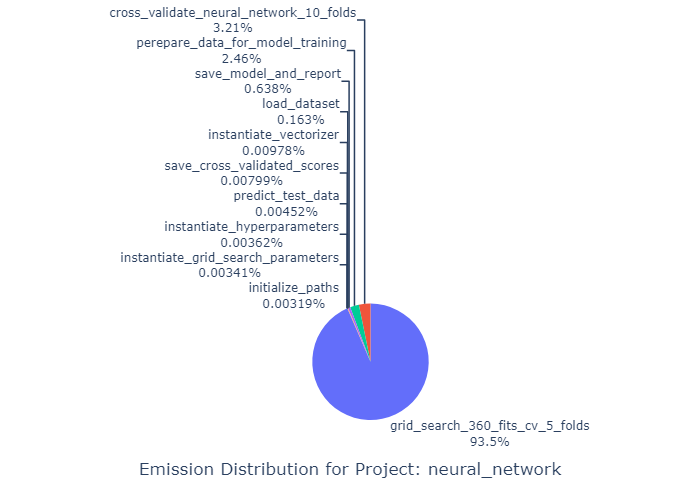
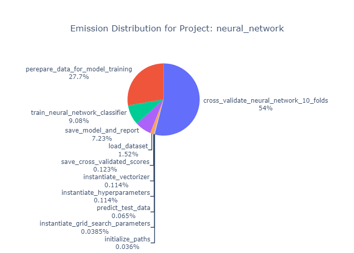
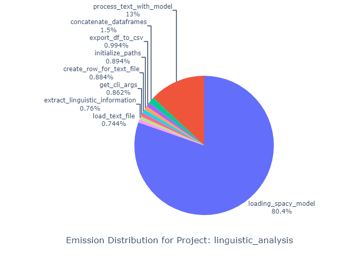
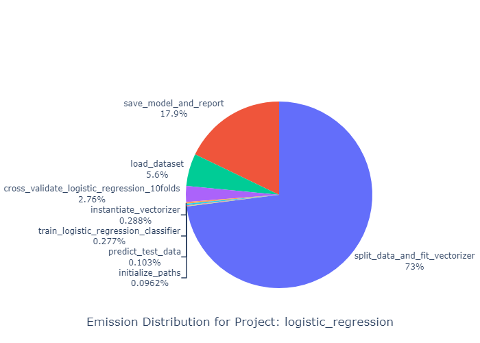
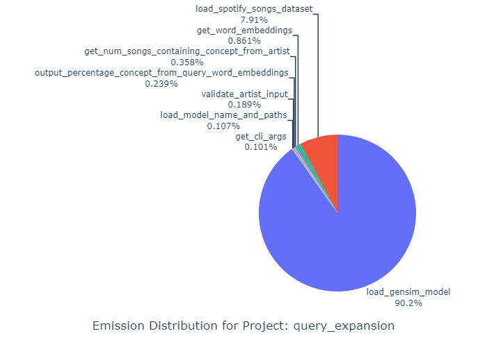

# 🌎 Evaluating environmental impact with CodeCarbon
This project aims to measure and analyze the carbon emissions produced by machine learning, specifically examined through measuring the emissions emitted from the projects in this portfolio. The project leverages the CodeCarbon library for tracking carbon emissions through energy consumption garnered from computational processes. The library provides utilities for benchmarking code emissions through approximating values of CO$_2$ emissions, which are expressed as kilograms of CO$_2$-equivalent (CO$_2$eq). Ultimately, the project aims to explore the environmental impact of conducting cultural data science.

## 📈 Data
This project utilizes the emissions produced by the other projects in this portfolio as a basis for evaluating the environmental impact of machine learning. The tracking of CO$_2$eq emissions was implemented through the CodeCarbon library.

## 📂 Project structure
```
└── environmental_impact_analysis
    ├── in/
    │    ├── combined_emissions.csv
    │    ├── emotion_analyis_emission_results.csv
    │    ├── feature_extraction_emission_results_new.csv
    │    ├── logistic_emission_results.csv
    │    ├── neural_emission_results.csv
    │    └── query_extension_emission_results.csv
    │
    ├── src/
    │    ├── data_processing.py
    │    ├── emission_tracker_class.py
    │    ├── generate_visualizations.py
    │    └── logger_utils.py
    │
    ├── README.md
    ├── requirements.txt
    ├── setup_unix.sh
    └── setup_win.sh
```

## ⚙️ Setup
To set up the project, you need to create a virtual environment and install the required packages. You can do this by running the appropriate setup script for your operating system.

### 🐍 Dependencies
Please ensure you have the following dependencies installed on your system:
- **Python**: `version 3.12.3`

### 💾 Installation
1. Clone the repository
```sh
git clone https://github.com/apathriel/cds-lang-analytics
```
2. Navigate to the project directory
```sh
cd assignment
cd environmental_impact_analysis
```
3. Run the setup script to install dependencies, depending on OS.
```sh
bash setup_unix.sh
```

4. Activate virtual environment (OS-specific) and run main py scripts.
```sh
source env/bin/activate
python src/data_processing.py
python src/generate_visualizations.py
```

## 🚀 Usage
Once the virtual environment is set up and dependencies are installed, run the `data_processing.py` script to generate a CSV file containing the emission tracking results for each project. Run the `generate_visualizations.py` to generate visualizations based on the emission data.

### 📋 Data processing
The project contains a script, `data_processing.py`, which is responsible for saving/loading data, and performing dataframe transformations. When directly running this script, all the csv files in the `in` directory are loaded, and concattenated. The resulting dataframe is saved to a csv file for further analysis.

### ♻️ CodeCarbon 
The ``emission_tracker_class.py ``script contains the ``SingletonEmissionsTracker`` class, which is responsible for tracking the carbon emissions of the projects using the CodeCarbon library. The class follows the Singleton design pattern, meaning only one instance of the class can exist. This is chosen so it can be instantiated across modules during runtime.

The class wraps the `EmissionTracker` class from the CodeCarbon library, and is responsible for task tracking, tracker control, and logging state of emission tracking. The class contains functionality for "normal" mode, where tracker is initialized and the `start()` and `stop()` methods are used, and the task mode, where individual sub tasks are tracked with `start_task(taskid)`. Task results are stored in the `task_results` dictionary, which the class is also responsible for handling and exporting through `create_dataframe_from_task_results` Additionally, the class contains a custom decorator method `track_emissions_decorator`. 

All methods are defined as static methods, since they don't need to access instance state (as there can only be one instance, thus negating the need for instance variables)

### 📉 Visualizations
The project contains a module for generating visualizations of the emissiosn data. The visualizations are generated through the `generate_visualizations.py` script. The script contains two main functions:
- `visualize_emissions_by_project()`: This function generates a visualization of total emissions of the portfolio, grouped by project. The visualization can be either a bar plot or a pie chart, depending on the `visualization_type` parameter. The function uses matplotlib and seaborn for the bar plot, and plotly for the pie chart.
- `visualize_emissions_from_subtasks_by_project()`:  This function generates a visualization of the emissions from each subtask for each project. The visualization can be either a bar plot or a pie chart, depending on the `visualization_type` parameter. The function uses matplotlib and seaborn for the bar plot, and plotly for the pie chart.

## 📊 Results
The generated visualizations are located in the `out` directory. Please note that the emission tracking results for the `neural_network` project contain emissions for computing a grid search of 72 options, cross-validated 5 times, totaling 360 fits of the classifier. I've included this grid search, with the intent of examining, albeit in a highly diminished capacity, how computationally expensive miniscule increases in performance can be.

When deconstructing the projects into individual sub-tasks, the degree of division largely became a case of personal judgement. I've attempted to ensure that the full emissions produced from the script are acounted for, while achieving a sensible subdivision of tasks.

Thus, I've chosen to track the emissions through the `start_task()` method, and by grouping the results by project, the total emission metric for the project has been calculated for further analysis. 

I feel the need to preface the forthcoming analyses and discussion by briefly contextualizing the CO$_2$eq emitted by the projects. Through summing all the emission values with the `sum_column_df` utility function, we can see that the total emissions from all the projects is 0.016379232730839334 kilograms, or 16.38 grams of CO$_2$eq. These figures seem quite unsubstantial , but obviously not reflective of the field of machine learning, limitations of the metric and tracking will be revisited. Contextualizing these values, [Meta](https://huggingface.co/meta-llama/Meta-Llama-3-70B) has reported the estimated total emissions for training Llama-3-8b and Llama-3-70B to be 2290 tonens CO$_2$eq. This is not including the emissions acrued through inference.


### 🖥️ Hardware
All the emission benchmarks were generated from running the projects on my laptop, a Clevo NP50DB model. Please see an overview of the detected parameters from CodeCarbon below. 


|     |    Hardware Parameters                                     |
|-----|-----------------------------------------|
| CPU | Intel(R) Core(TM) i5-10300H CPU @ 2.50GHz |
| RAM | 7.79 GB                    |
| GPU | 1 x NVIDIA GeForce GTX 1650 (4 GB)      |
| OS  | Windows-11-10.0.22631-SP0               |

**NB**: None of the scripts included functionality for running on the system GPU, beyond any default settings from the modules. `gpu_ids` was set to `None`, to prevent CodeCarbon from calculating GPU power as well. `tracking_mode` was set to `process`, in an attempt to isolate the CO$_2$eq emissions from the  projects. 

### 🗃️ Portfolio Emissions
The visualizations were generated with the intent of answering the following question:

> Which assignment generated the most emissions in terms of CO₂eq?


| Total emissions | Total emissions |
|----------|----------|
|   |    |

A tendency is immediately observable from the simple eye-test: The emotion analysis project is by far the largest contributor of emissions. The project entailed processing the entire script of the Game of Thrones television show through an emotion classifcation pipeline. This project utilizes the most complicated model architecture, a large transformer model, whilst also processing a relatively large corpus.

The subtask emissions were quite hard to visualize, due to the distribution of emissions being overwhelmingly emitted by the `run_emotion_analysis_pipeline` task, which consits of the model inference.



The second most computationally intensive project was the text classification task, specifically the neural network script.



Again, quite difficult to create a simple, easily analyzable graphic. Hoewever, looking at the visualization, it's immediately observable that the emissions produced can largely be attributed to the (optional) grid search. The grid search resulted in marginal (if any) improvements to performance, perhaps reflecting a greater trend in machine learning, where performance is prioritized above all else, even at great environmental costs only resulting in marginal improvements.



Visualization the result of running the script without performing the grid search presents a somewhat more nuanced distribution. 29.7% of the emissions were produced from splitting and vectorizing the corpus, with an additional 2% from loading the dataset. This cost could be circumvented by vectorizing the dataset, and dumping/loading the resulting data. 

59.8% of the emissions were produced from performing a 10 fold cross-validation. This functionality was implemented with the intent of producing a more robust evaluation of the model, evidently at a cost of increased emissions, although somewhat negligable at these values. 

7.89% of the emissions were produced from saving the model, vectorizer and report. This attests to the computation cost of I/O operations. Perhaps this sub-task could've been further divided to examine the efficiency of the `joblib` library which was used to save the model and vectorizer.

| Feature extraction | Text classification | Query expansion|
|----------|----------|----------|
|   |    |   |

The three remaining projects all have quite low emissions comparably. The feature extraction and query expansion projects utilize pre-trained models to perform comparatively simplistic tasks, resulting in lower emissions. The logistic regression implementation of the text classification project largely mirrors the neural network, altough with observably lower costs of training the classifier. This is likely due to the large amount of parameters of neural networks, even with relatively simple architectures.

### 📝 Limitations
The CodeCarbon library inevitably produces an approximation: There's obviously a large amount of parameters determining the projected CO$_2$eq, like hardware and location. That being said, by no means a fruitless approximation. The abstractions of environmental impact provided by CodeCarbon's emission tracking provides insights into the relative carbon footprint of different computational tasks. Generally, this methodology promotes awareness concerning the environmental effects of computation. Practically, this can aid developers and researchers in adopting environmentally friendly modeling choices and code efficiency in their work.

CodeCarbon computed the approximated CO$_2$eq through electricity, which is an obvious metric. Other metrics like water might be considered, albeit more relevant when considering the training of LLMs.

When considering these results, and generally when working with modern LLMs, the training- and inference costs are largely abstracted, or even obfuscated. This means that the energy consumption and carbon emissions associated with these processes are often not visible to users. CodeCarbon provides a tool for considering these impacts, thus aiding in the mission of reducing CO$_2$ emissions produced from machine learning.


## 📖 References
- [codecarbon library](https://github.com/mlco2/codecarbon)
- [Meta Llama 3 model card on Hugging Face](https://huggingface.co/meta-llama/Meta-Llama-3-70B)